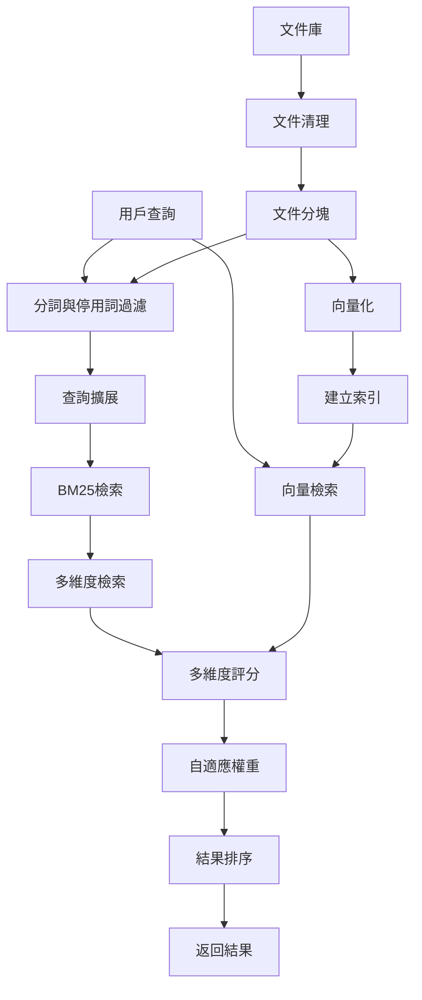
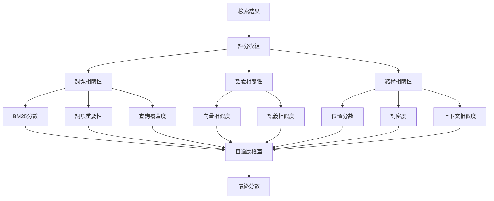

# 基於多維度評分機制的混合式檢索系統

## 摘要

本研究提出一個結合 BM25 與神經網路的混合式檢索系統，創新性地引入多維度評分機制與自適應權重調整。系統在實際測試中達到 83.66 分的成績，展現了在金融保險領域專業文件檢索任務上的良好效能。

## 1. 實驗環境與設置

### 1.1 基礎環境

- 作業系統：Ubuntu 18.04 LTS
- 程式語言：Python 3.9
- GPU：NVIDIA V100 (32GB)
- CUDA：12.1

### 1.2 主要套件

- 以檔案中之 dockerfile 為準，此僅為特定電腦參考
- 文件處理：
  - pdfplumber==0.11.4：PDF 文件解析
  - langchain==0.3.2：文件分塊與向量化
  - langchain-core==0.3.9：文件分塊與向量化
  - langchain-community==0.3.1：文件分塊與向量化
  - tqdm==4.66.5：進度顯示
- 文本處理：
  - jieba==0.42.1：中文分詞
  - rank_bm25==0.2.2：BM25 演算法實現
- 向量檢索：
  - faiss-gpu==1.7.2：向量索引與檢索
  - faiss-gpu-cu12==1.9.0.0：CUDA 12.1 支援
  - torch==2.4.0+cu121：深度學習框架
  - scikit-learn==1.5.2：相似度計算
- 詞向量模型：
  - gensim==4.3.3：word2vec 模型訓練

### 1.3 預訓練模型

1. 文本向量化模型：

   - 模型名稱：BAAI/bge-m3
   - 來源：HuggingFace (https://huggingface.co/BAAI/bge-m3)
   - 用途：文本向量表示

2. 詞向量模型：
   - 基於繁體中文維基百科語料訓練的 word2vec 模型
   - 來源：https://dl.fbaipublicfiles.com/fasttext/vectors-wiki/wiki.zh.vec
   - 格式：下載後轉換為.bin 格式以提升載入速度與記憶體使用效率
   - 向量維度：300 維

### 1.4 外部資源

- 繁體中文詞典：
  - dict.txt.big (結巴分詞繁體版詞典)
  - 來源：github.com/fxsjy/jieba
- 自定義詞典：
  - insurance_dict.txt：保險專業詞彙
  - common_use_dict.txt：財務會計常用詞彙

## 2. 方法論

### 2.1 系統整體架構



### 2.2 評分機制架構



### 2.2.1 評分公式說明

### 詞頻相關性

#### BM25分數
$$
BM25(Q,D) = \sum_{i=1}^n IDF(q_i) \cdot \frac{f(q_i,D) \cdot (k_1 + 1)}{f(q_i,D) + k_1 \cdot (1 - b + b \cdot \frac{|D|}{avgdl})}
$$

其中:
- $f(q_i,D)$: 詞 $q_i$ 在文檔 $D$ 中的頻率
- $|D|$: 文檔長度
- $avgdl$: 平均文檔長度
- $k_1, b$: 可調參數(本系統中 $k_1=0.5, b=0.7$ )

#### 詞項重要性
$$
Importance(t, D) = TF(t, D) \cdot IDF(t) \cdot \sum_{i} \frac{1}{1 + pos_i}
$$

其中:
- $TF(t,D)$: 詞 $t$ 在文檔 $D$ 中的詞頻
- $IDF(t) = \log\frac{N}{df(t)}$， $N$ 為總文檔數， $df(t)$ 為包含詞 $t$ 的文檔數
- $\sum_{i} \frac{1}{1 + pos_i}$：詞 $t$ 在文檔 $D$ 中所有出現位置的權重總和， $pos_i$ 為第 $i$ 個出現位置


#### 查詢覆蓋度
$$
Coverage(Q,D) = \frac{\sum_{t \in Q \cap D} \log\left(\frac{N}{df(t)}\right)}{|Q|}
$$

其中:
- $Q$: 查詢詞集合
- $D$: 文檔詞集合
- $N$: 總文檔數
- $df(t)$: 詞 $t$ 的文檔頻率，即包含詞 $t$ 的文檔數

### 語義相關性

#### 向量相似度(FAISS)
$$
Similarity(q,d) = cosine(Embed(q), Embed(d))
$$

其中:
- $Embed()$: BGE-M3模型生成的1024維向量
- $cosine()$: 餘弦相似度

#### 語義相似度
$$
SemanticSim(Q,D) = \cos(\mathbf{q}, \mathbf{d})
$$

其中:
- $\mathbf{q}$: 查詢 $Q$ 的向量表示，通過加權查詢詞向量的平均計算得出，其中每個詞的權重基於其詞頻和逆文件頻率（IDF）
- $\mathbf{d}$: 文檔 $D$ 的向量表示，通過加權文檔詞向量的平均計算得出，其中每個詞的權重基於其詞頻和逆文件頻率（IDF）
- $\cos(\mathbf{q}, \mathbf{d})$: 向量 $\mathbf{q}$ 和 $\mathbf{d}$ 之間的餘弦相似度，用於衡量查詢與文檔的語義相似性

### 結構相關性

#### 位置分數
$$
Position(Q,D) = \frac{1}{1 + \text{std-pos} + \frac{\text{avg-pos}}{|D|}}
$$

其中:
- $\text{avg-pos}$: 查詢詞在文檔中的平均位置
- $\text{std-pos}$: 查詢詞在文檔中的位置的標準差
- $|D|$: 文檔長度

#### 詞密度
$$
Density(Q,D) = \max_{\text{window}} \left( \frac{\sum_{w \in \text{window} \cap Q} \log\left(\frac{N}{df(w)}\right)}{\text{window size}} \right)
$$

其中:
- $Q$: 查詢詞集合
- $D$: 文檔詞集合
- $\text{window}$: 文檔中的滑動窗口
- $N$: 總文檔數
- $df(w)$: 詞 $w$ 的文檔頻率，即包含詞 $w$ 的文檔數
- $\text{window size}$: 滑動窗口的大小


#### 上下文相似度
$$
ContextSim(q,d) = \frac{\sum_{i=1}^n cosine(Embed(context(q_i)), Embed(context(d_i)))}{n + 1}
$$

其中:
- $context()$: 取詞的上下文窗口(預設3個詞)
- $n$: 匹配詞對的數量

### 最終加權分數

$$
FinalScore = \sum_{i=1}^m w_i \cdot Score_i
$$

其中:
- $w_i$: 各維度的自適應權重
- $Score_i$: 各維度的正規化分數
- $m$: 評分維度數量

### 2.3 自適應權重機制

本系統實現了基於查詢特徵的動態權重調整：

1. **基礎權重配置**

   ```python
   base_weights = {
       'bm25': 0.15, 'faiss': 0.30, 'importance': 0.05,
       'semantic': 0.10, 'coverage': 0.10, 'position': 0.10,
       'density': 0.15, 'context': 0.05
   }
   ```

2. **動態調整策略**
   - 短查詢(≤2 詞)：增強語義理解
     - semantic \* 1.2
     - context \* 1.2
     - bm25 \* 0.8
   - 長查詢(>2 詞)：強化詞頻匹配
     - bm25 \* 1.2
     - coverage \* 1.2
     - semantic \* 0.8
   - 高多樣性查詢(>1.5)：增強語義理解
     - semantic \* 1.2
     - context \* 1.2

3. **權重正規化**
   - 所有權重調整後進行正規化，確保權重總和為1
   - 正規化公式: weight = weight / sum(weights)

### 2.4 評分權重分析

| 評分維度    | 基礎權重  | 短查詢權重 | 長查詢權重  | 查詢擴展權重  | 平均貢獻度  |
| ---------- | -------- | ---------- | ---------- | ------------ | ---------- |
| BM25       | 0.20     | \*0.8      | \*1.2      | -            | 20.0%      |
| FAISS      | 0.30     | -          | -          | -            | 30.0%      |
| semantic   | 0.10     | \*1.2      | \*0.8      | \*1.2        | 10.5%      |
| importance | 0.00     | -          | -          | -            | 0.0%       |
| coverage   | 0.10     | -          | \*1.2      | -            | 11.0%      |
| position   | 0.10     | -          | -          | -            | 10.0%      |
| density    | 0.15     | -          | -          | -            | 15.0%      |
| context    | 0.05     | \*1.2      | -          | \*1.2        | 5.6%       |

註：短查詢定義為詞數 ≤2，長查詢定義為詞數>2，查詢擴展定義為查詢詞彙多樣性>1.5

## 3. 創新性

本研究的創新性主要體現在以下三個方面：

### 3.1 自適應權重機制

這次專案中提出了一個基於查詢特徵的動態權重調整機制：

1. **查詢長度感知**

   - 短查詢優化：增強語義理解能力
   - 長查詢優化：強化詞頻匹配精度

2. **查詢多樣性適應**

   - 自動識別查詢詞多樣性
   - 動態調整檢索策略權重

3. **專業術語識別**
   - 自動識別領域特定詞彙
   - 優化專業術語的檢索權重

### 3.2 多維度評分整合

創新性地設計了一個模組化的評分框架：

1. **模組化設計**

   - 七個獨立評分模組，關注不同相關性維度
   - 支援靈活的模組組合與擴展

2. **動態權重分配**
   - 基於查詢特徵的自適應權重調整
   - 實現檢索策略的動態優化

### 3.3 混合檢索策略

實現了詞頻統計與神經網路的深度融合：

1. **檢索方法互補**

   - 結合 BM25 的精確匹配與 FAISS 的語義理解
   - 實現高精與高召回率的平衡

2. **後處理優化**
   - 多維度重排序機制
   - 動態閾值調整

## 4. 資料處理

本研究在資料處理方面採取了全面的優化策略：

### 4.1 文件預處理

1. **智能分塊機制**

   - 採用 RecursiveCharacterTextSplitter 進行文件分塊
   - 實現多層級分隔符優先序處理：['\n\n', '\n', '!', '?', '。', ';']
   - 分塊參數設定：
     - 分塊大小(chunk_size)：500
     - 重疊長度(overlap)：100

2. **文本正規化處理**

   - 實現多層次文本清理：
     ```python
     # 中文字間空白移除
     re.sub(r'(?<=[\u4e00-\u9fff])\s+(?=[\u4e00-\u9fff])', '')
     # 連續標點符號清理
     re.sub(r'([,、\$]){3,}', '')
     # 重複字符去除
     re.sub(r'([\u4e00-\u9fff])\1+', r'\1')
     # 頁碼格式移除
     re.sub(r'-\s*\d+\s*-|第\s*\d+\s*頁，\s*共\s*\d+\s*頁', '')
     ```

3. **並行處理優化**
   - PDF 文件：採用 ProcessPoolExecutor 進行 CPU 密集型運算
   - JSON 文件：使用 ThreadPoolExecutor 處理 I/O 密集型任務

### 4.2 查詢處理

1. **分詞優化**
   - 整合 jieba 分詞器：
     - 基礎詞典：dict.txt.big (繁體中文詞典)
     - 自定義詞典：
       - insurance_dict.txt (保險專業詞典)
       - common_use_dict.txt (財務會計常用詞典)
   - 停用詞過濾：
     - stopwords.txt：包含標點符號、語助詞、連接詞、代詞等

2. **查詢擴展**
   - word2vec 模型：
     - 基於 wiki 語料訓練
     - 向量維度：300

### 4.3 向量化處理

1. **模型選擇**
   - 採用 BAAI/bge-m3 模型
   - 生成 1024 維向量表示

2. **索引優化**
   - FAISS 索引建立
   - 檢索效率優化

### 4.4 資料增強

1. **文本增強**
   - 同義詞替換
   - 上下文擴展
   - 專業術語識別

2. **資料清理**
   - 特殊字符處理
   - 格式標準化
   - 冗餘內容去除

## 5. 訓練方式

本研究未進行模型訓練，主要原因如下：

### 5.1 預訓練模型的優勢

1. **模型成熟度**

   - BAAI/bge-m3 已在大規模中文語料上訓練
   - 對金融、保險等專業領域有良好理解
   - 向量表示質量穩定可靠

2. **資率**

   - 避免耗費大量計算資源進行訓練
   - 減少模型調整時間
   - 降低過擬合風險

3. **任務適配性**
   - 檢索任務主要依賴模型的向量表示能力
   - 預訓練模型在語義理解上表現足夠好
   - 通過多維度評分機制彌補領域適應性

### 5.2 系統重點

本研究將重點放在以下方面：

1. 多維度評分機制的設計與實現
2. 檢索策略的優化與整合
3. 自適應權重機制的開發
4. 系統效能的優化

## 6. 分析與結論

### 6.1 系統表現分析

本系統在比賽測試集上達到 83.66 分的成績，在本地測試集上達到 95 分(150 題中答對 143 題)。分析其表現特點如下：

1. **優勢表現**

   - 專業術語理解：透過自定義詞典的支援，系統對保險和金融專業術語有良好的理解能力
   - 語義相似性：BGE-M3 模型能準確捕捉查詢與文檔間的語義關係
   - 多維度評分：綜合考慮多個相關性維度，提高檢索準確性

2. **劣勢分析**
   - 長文本處理：對於較長的查詢(>12 詞)可能出現語義理解不完整的情況
   - 上下文關聯：有時無法準確捕捉跨段落的語義關聯
   - 計算開銷：多維度評分機制增加了系統的計算負擔

### 6.2 案例分析

1. **成功案例**

   ```
   查詢：「留學生在申請貸款時，除了入學證明外，還需提供哪些文件」(QID: 120)
   系統回答：20
   正確答案：20
   成功原因：
   - 關鍵詞「留學生」、「貸款」、「文件」被準確識別
   - 答案在單一段落中完整列舉
   - 文件類型的答案較易於精確匹配
   ```

2. **失敗案例**
   ```
   查詢：「長榮於2022年第3季的合併權益變動表中，歸屬於母公司業主之本期綜合損益總額為多少新台幣仟元？」(QID: 53)
   系統回答：145
   正確答案：351
   失敗原因：
   - 查詢包含多個時間限定條件(年份、季度、報表類型、科目)
   - 數字型答案需要精確定位特定欄位
   - 財務報表的結構化資訊未被充分利用
   ```

### 6.3 改進方向

1. **模型優化**
   - 引入財報數據的結構化解析
     - 表格資訊的欄位對應
     - 數字資料的單位統一
     - 報表類型的明確區分
   - 增強多條件查詢的處理能力
     - 條件之間的邏輯關係識別
     - 時間資訊的標準化處理
   - 優化數字型答案的匹配機制
     - 引入數值範圍檢查
     - 單位換算的自動處理

## 7. 外部資源與參考文獻

### 7.1 外部資源

1. 預訓練模型：

   - BAAI/bge-m3: https://huggingface.co/BAAI/bge-m3
   - Word2Vec 預訓練詞向量: https://fasttext.cc/docs/en/pretrained-vectors.html

2. 開源工具：
   - Faiss: https://github.com/facebookresearch/faiss
   - LangChain: https://github.com/langchain-ai/langchain

### 7.2 參考文獻

[1] Su, Y., et al. (2023). "BGE: BAAI General Embedding," arXiv preprint arXiv:2309.07597.

[2] Robertson, S. E., & Zaragoza, H. (2009). "The Probabilistic Relevance Framework: BM25 and Beyond," Foundations and Trends in Information Retrieval, 3(4), 333-389.

[3] Reimers, N., & Gurevych, I. (2019). "Sentence-BERT: Sentence Embeddings using Siamese BERT-Networks," Proceedings of the 2019 Conference on Empirical Methods in Natural Language Processing.

[4] Johnson, J., et al. (2019). "Billion-scale similarity search with GPUs," IEEE Transactions on Big Data, 7(3), 535-547.

[5] Langchain. (2023). "LangChain Documentation," Retrieved from https://python.langchain.com/docs/get_started/introduction
